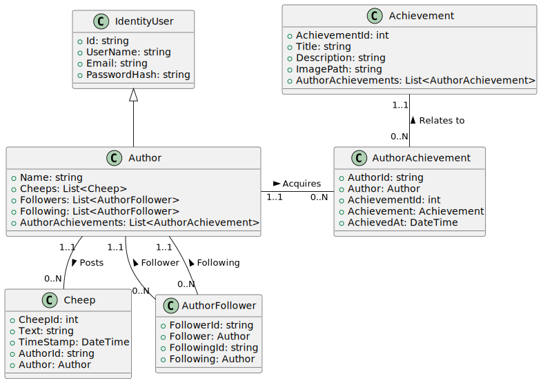
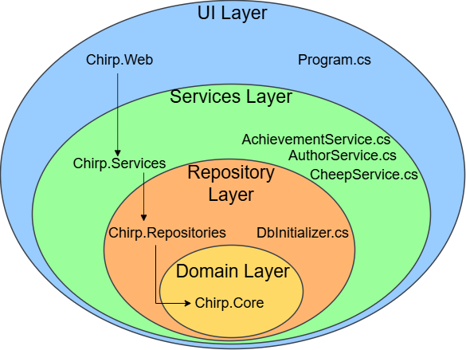
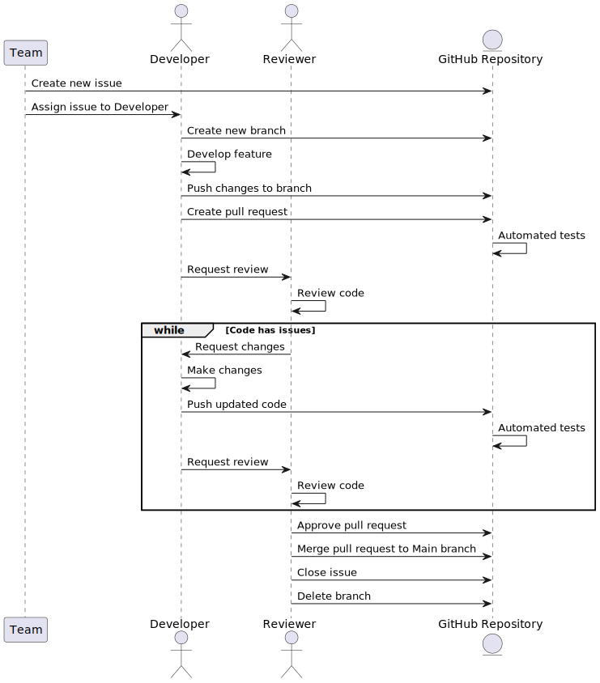

# Design and Architecture of _Chirp!_

## Domain model

_Chirp!_ revolves around five key entities:

- **Author:** Extends ASP.NET IdentityUser, enabling authentication and user management.
- **Cheep:** Represents posts with attributes like `Text` and `Timestamp`.
- **AuthorFollower:** Tracks follower relationships between authors.
- **Achievement:** Defines milestones with attributes like `Title` and `Description`.
- **AuthorAchievement:** Links authors to unlocked achievements, with metadata like `AchievedAt`.

A UML class diagram of the domain model can be seen below.



> Note: `IdentityUser` has been simplified in the diagram.

## Architecture — In the small

Illustrated below is our _Chirp!_ application in Onion Architecture. The different 
layers are:

- UI Layer: Handles user interactions and renders pages using Razor Pages.
- Services Layer: Is responsible for data flow between the repository and UI layers.
- Repository Layer: Manages data access, interacting with the database via Entity Framework.
- Domain Layer: Contains DTOs, interfaces and the domain model.



## Architecture of deployed application

When a user wants to interact with our application, they can do so in two different ways.
Being that the user can choose to either run it locally or remotely.

Local Architecture:
The client accesses the web application, which is hosted locally and directly
interacts with the local database to process and retrieve data (see the diagram below).


Remote Architecture:
Clients connect to the web server over the internet, allowing the server
to communicate with the Azure database for data processing and storage (see the diagram below).


## User activities

We distinguish between two types of users: authorized and non-authorized. Authorized users are those who are logged in. Non-authorized users, on the other hand, are not logged in and have limited access to the application's features. Non-authorized users, can become authorized by either registering or logging in.

A **non-authorized** user can:

- Register
- Login
- View public or private timelines
- Navigate pages via buttons

An **authorized** user can:

- Logout
- View public or private timelines
- Navigate pages via buttons
- Post new cheeps
- Follow or unfollow other authors
- Edit Bio
- View About Me page
- Delete all associated data via Forget Me

We have illustrated, a typical scenario of a non-authorized user's journey through our _Chirp!_ application.


Likewise, a typical scenario of an authorized user's journey can be seen below.


> Note: Certain functionality of our Chirp! application has been omitted in this Diagram to improve readability. One such function is the ability to cancel while editing your bio. Additionally, while the diagram may suggest it is possible to post Cheeps on other users' private timelines, this is intentionally not allowed in our application, as users can only post Cheeps to the  public- or their own timelines.

## Sequence of functionality/calls through _Chirp!_

The UML sequence diagram below illustrates the flow of messages and data within _Chirp!_ when an unauthorized user sends an HTTP request to the root endpoint. If the user were authorized and viewing their own timeline, additional data such as followers, following, bio, and achievements would also be fetched.


# Process

## Build, test, release, and deployment

We have created three GitHub Actions workflows that carry out their different tasks:

- **Build and Test:** Automates building the solution, installing dependencies, and running tests.
- **Release:** Packages the application, creates artifacts, and publishes releases for tagged versions.
- **Deployment:** Deploys the published application to Azure Web App for production.

Three UML activity diagrams can be seen below for each of our GitHub action workflows respectively:

The first diagram is of our build and test workflow, which focuses exclusively on validating changes by building and testing the code. It provides fast feedback as it does not produce any artifacts for release or deployment.


The second diagram not only builds and tests but also creates a versioned release which publishes executables for different environments (linux-x64, macOS-x64, Windows-x64), that are ready for sharing.


The last diagram focuses on continuous deployment of the application to a live Azure Web App environment ensuring it's always up to date.


## Teamwork

As shown in the project board screenshot below, the following tasks are unresolved:

- Integration tests for authorized endpoints

While the application does contain integration tests, it does not cover integration tests for authorized endpoints.
These tests would require simulating an authorized user, which our final application does not support.
However many of the errors that would be caught with the missing integration tests are already caught by our end to end tests.

- Downloadable zip on about me page

All information stored about the user is displayed on the About me page. However our application does not support downloading this information. We did not prioritize implementing this feature as it was optional.

- Return to Chirp.CLI application

We regrettably did not manage to get the Chirp.CLI application running on Azure. We also did not entirely finish testing. We meant to complete these tasks at a later time, but chose to prioritize working on the Chirp web application instead.

Below a diagram of our final project board can be seen with some of our uncompleted issues. 


The development of _Chirp!_ followed an organized process, using the project board to keep track of tasks.

1. **Issue creation:** New issues were created after lectures when new features were introduced, or when bugs were identified. An issue would initially be placed in `Todo`, and would include a clear description of the success criteria. A team member would be appointed responsible for resolving it.
2. **Development:** Once assigned, the developer created a new branch from the main branch. The issue would be moved to `In Progress`. Progress would regularly be committed and pushed to the new branch.
3. **Code review:** After implementing a feature, a pull request was created for code review. The developer would notify the reviewer, and the code would be evaluated.
4. **Testing:** The new feature would be thoroughly tested to ensure its functionality. This included running automated tests, as well as performing manual testing.
5. **Merge into Main:** Once the feature passed the review and testing phases, it was merged into the main branch. The issue would then be moved to `Done` and the branch would be deleted.

The process is illustrated in the UML sequence diagram below:



## How to make _Chirp!_ work locally

**Prerequisites:**

- Install [.NET 8.0 SDK](https://dotnet.microsoft.com/en-us/download/dotnet/8.0)

**Clone the repository:**

Open a terminal and run:

```sh
git clone https://github.com/ITU-BDSA2024-GROUP8/Chirp.git
cd Chirp
```

**Install dependencies:**

Run:

```sh
dotnet restore
```

**(Optional) Enable OAuth:**

Follow GitHub's guide on [Creating an OAuth app](https://docs.github.com/en/apps/oauth-apps/building-oauth-apps/creating-an-oauth-app) to obtain a Client-Secret and -Id. Once these are acquired, run:

```sh
dotnet user-secrets init
dotnet user-secrets set "Authentication_GitHub_ClientSecret" "12345-Your-ClientSecret-12345"
dotnet user-secrets set "Authentication_GitHub_ClientId" "123-Your-ClientId-123"
```

**Run the application:**

Start the server:

```sh
cd src/Chirp.Web
dotnet run
```

**Access the application:**

Open your browser and navigate to:

```sh
http://localhost:5273/
```

You should see the _Chirp!_ public timeline and be able to interact with the application.
Ensure you can register/login, view timelines, post cheeps and follow/unfollow authors.

## How to run test suite locally

Once you have made sure you can run the program locally as described above, you have to install the required browsers for playwright to work. 

**Install required browsers:**

Make sure to run the following commands one by one in this order.

Install:

```sh
dotnet new tool-manifest
dotnet tool install Microsoft.Playwright.CLI
dotnet tool run playwright install
```

**Run tests:**

Make sure you are either in the base Chirp directory or in a specific test directory.

Start tests/test:

```sh
dotnet test
```

Do not stop the test manually since this can potentially cause the tests to fail until they have run through, so they can perform the clean-up.

# Ethics

## License

We chose the MIT license for our application because it's simple and easy to use. It allows others to freely use, modify, and share our code as long as they include the original copyright and license notice.

## LLMs, ChatGPT, CoPilot, and others

We used ChatGPT and GitHub Copilot to help us write code, debug issues, and brainstorm solutions. Their responses were often useful and provided good suggestions that sped up our workflow. However, there were times when the tools offered suggestions that were off the mark or incorrect, which occasionally slowed us down. Despite these issues, using LLMs overall made development faster and more efficient.
